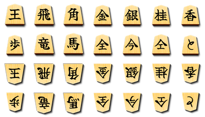

# Saturn Shogi Pieceset

Generate shogi piece images by compositing kanji characters onto wood textures with an engraved effect.



*Low resolution preview. Run the generator for full 1500×1500px pieces.*

## Requirements

- Python 3
- Pillow

## Setup

```bash
python -m venv venv
source venv/bin/activate
pip install -r requirements.txt
```

## Usage

```bash
python src/main.py
```

Generated pieces are saved to `build/`.

## Customization

Edit `src/main.py` to:
- Adjust text positions and font sizes
- Change engraving colors
- Add or remove pieces
- Modify shadow/highlight effects

## License

- **Code** (`src/`): MIT License (see [LICENSE](LICENSE))
- **Art assets** (`resources/`): CC0 (Public Domain)
- **Generated pieces** (`build/`): CC0 (Public Domain)
- **Font** (`fonts/YujiMai-Regular.ttf`): SIL Open Font License (see [OFL.txt](fonts/OFL.txt))
